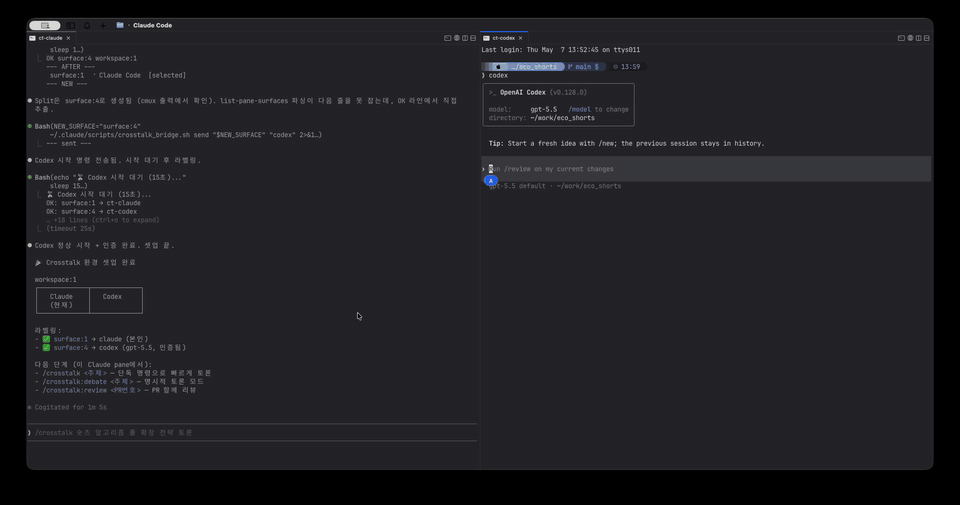

# Crosstalk

> 한 명령으로 Claude · Codex · Gemini를 동시에 토론시키는 Claude Code 플러그인



> 한 줄로 셋이 토론하고 종합 의견까지.

---

## 🤔 무슨 도구인가요

세 AI CLI(Claude / Codex / Gemini)를 cmux 분할창에 띄워두고, 한 슬래시 커맨드로 자동 토론을 진행해 종합 의견을 받는 도구입니다.

- **구독제 그대로 사용** — Max / Pro 계정의 CLI를 그대로 호출. API 키 별도 비용 없음.
- **자동 사회자 배정** — 명령을 호출한 본인이 사회자가 됨. 나머지는 참여자.
- **두 가지 모드**
  - 일반 토론: `/crosstalk 주제`
  - PR 리뷰 토론: `/crosstalk:review 1440` (또는 `--deep` 으로 깊은 분석)
- **컨텍스트 격리** — 메인 세션은 결과만 받고, 토론 중 추론은 옆 pane에서 별도 처리.

---

## 📦 사전 요구사항

| 도구 | 버전 | 필수? | 설치 |
|------|------|------|------|
| macOS | 14.0+ | ✅ | (cmux가 macOS 전용) |
| Node.js + npm | 18+ | ✅ | https://nodejs.org/ 또는 `brew install node` |
| cmux | 1.3+ | ✅ | `brew install --cask cmux` 또는 https://www.cmux.dev/ |
| gh CLI | 최신 | 선택 | `brew install gh && gh auth login` (PR 리뷰 용) |

**AI CLI 구독** (사용할 것만):
- Claude Max / Claude Code 무료 — 자동 설치 가능
- Codex Pro 또는 ChatGPT Plus — 자동 설치 가능
- Gemini Pro 또는 무료 — 자동 설치 가능

---

## 🚀 5분 설치

### 1. cmux 설치

```bash
brew install --cask cmux
```

### 2. Crosstalk 플러그인 등록 + 설치

Claude Code에서:

```
/plugin marketplace add dongsik93/crosstalk
/plugin install crosstalk@dongsik93/crosstalk
```

### 3. 최초 셋업 (1회)

```
/crosstalk:install
```

이 명령이 자동 처리:
- 누락된 AI CLI npm 자동 설치 (`@openai/codex@latest`, `@google/gemini-cli@latest`)
- bridge 스크립트 사용자 홈 복사 (`~/.claude/scripts/crosstalk_bridge.sh`)
- 단독 명령 활성화 (`/crosstalk` 호출 가능)

### 4. cmux 환경 자동 셋업

```
/crosstalk:launch
```

cmux 실행 → 분할 → 각 pane에서 AI CLI 시작 → 라벨링까지 자동.

### 5. 토론 시작

cmux 창의 Claude pane에서:

```
/crosstalk 신규 안드로이드 프로젝트, Compose vs XML?
```

---

## 📚 명령어

### 토론
| 명령 | 설명 |
|------|------|
| `/crosstalk <주제>` | 일반 토론 단축 — `install` 이후 활성 |
| `/crosstalk:debate <주제>` | 일반 토론 (1:1 또는 다자) |
| `/crosstalk:debate --rules <name> <주제>` | 룰 일회성 명시 |
| `/crosstalk:debate --persona <name> <주제>` | 페르소나 일회성 명시 |
| `/crosstalk:review [PR번호]` | PR 리뷰 토론 (빠른 모드) |
| `/crosstalk:review --deep [PR번호]` | PR 리뷰 토론 (깊은 모드) |

### 룰/페르소나 관리
| 명령 | 설명 |
|------|------|
| `/crosstalk:status` | 현재 active 셋업 + 사용 가능 목록 |
| `/crosstalk:rules` | 토론 룰 전환/생성/편집/삭제 |
| `/crosstalk:persona` | 페르소나 전환/생성/편집/삭제 |

### 환경
| 명령 | 설명 |
|------|------|
| `/crosstalk:setup` | cmux pane 라벨링 |
| `/crosstalk:launch` | cmux 자동 분할 + AI CLI 시작 + 라벨링 |
| `/crosstalk:install` | 최초 셋업 (컴포넌트 + AI CLI 자동 설치) |
| `/crosstalk:uninstall` | 컴포넌트 제거 |

### 토론 동작

- **일반 토론**: 한쪽이 답변에 `[AGREE]` 표시 또는 15턴 도달 시 종료, 종합 의견 출력.
- **다자 토론**: 셋이 [AGREE] 도달 또는 10라운드 도달 시 종료. 사회자가 라운드별 종합.
- **PR 리뷰 토론**: 1단계 — 각 AI 독립 리뷰 / 2단계 — 머지 가부 토론.
- 종료 후 토론 로그 보관 여부 질문 (보관 시 `~/Documents/crosstalk/`에 저장).
- Ctrl+C 안전 정지 — 모든 참여자에 정지 신호 + 부분 결과 종합.

---

## 🎬 데모


cmux 안에서 `/crosstalk` 한 명령으로 셋이 토론 → 합의 → 종합 의견까지 자동 진행.

---

## 🎭 토론 룰 + 페르소나 커스터마이징

기본 동작도 좋지만, 토론 분위기와 캐릭터를 조합하면 시나리오별 토론을 만들 수 있다.

### 빌트인 룰

| 룰 | 분위기 |
|-----|--------|
| `default` | 한 단락 3-5문장, 안전 모드, 건전 토론 |
| `brainstorm` | 짧고 빠르게, 합의 우선, Yes-and 응답 |
| `debate` | 깊이있게, 데빌즈 어드보킷, 합의 신중 |

### 빌트인 페르소나

| 페르소나 | 역할 매핑 |
|---------|----------|
| `default` | 페르소나 없음 — 본연의 시각 |
| `senior-junior` | 시니어(보수) vs 주니어(진보) |
| `critic-builder` | 비판가 vs 빌더 (Yes-and) |
| `triple-perspective` | 보수/혁신/실용 (3분할 전용) |

### 사용 예

```
/crosstalk:rules                              # 룰 전환/생성/편집
/crosstalk:persona                            # 페르소나 관리
/crosstalk:status                             # 현재 셋업 한눈에

# 일회성으로 다른 룰/페르소나 적용
/crosstalk:debate --rules debate --persona critic-builder PR 머지해도 되나?
```

새 룰/페르소나는 `~/.claude/crosstalk/rules/`, `~/.claude/crosstalk/personas/`에 마크다운으로 추가하면 즉시 사용 가능.

---

## ⚠️ 알려진 한계

| 한계 | 영향 |
|------|------|
| **macOS + cmux 전용** | Linux/Windows 미지원 (cmux 의존). |
| **답변이 매우 길면 화면 위쪽이 스크롤되어 잘림** | `cmux read-screen`이 보이는 영역만 캡처. 마커 인식엔 영향 없으나 본문 보존 약함. |
| **CLI 푸터 패턴 매칭은 폴백** | CLI 버전 업그레이드 시 푸터 디자인 변경되면 자동 감지 실패. `/crosstalk:setup` 으로 라벨 박으면 안정. |
| **답변 중 사용자 직접 입력 시 핑퐁 깨짐** | `INTERVENTION` 감지로 알림은 가능하나 자동 복구는 못 함. 토론 중 다른 pane에 입력 자제. |
| **각 CLI 안의 동작 제어 불가** | 토론 중 상대 AI가 파일 수정/셸 명령 실행해도 막을 방법 없음. 안전 모드 프리앰블로 *텍스트 의견만* 가이드만 가능. |
| **Codex 사회자 모드** | v0.1 미지원. 현재는 Claude만 사회자 가능. v0.2.0 예정. |

---

## 🛠️ 기여 / 이슈

이슈와 PR 환영합니다. 특히:

- 새 CLI(Qwen, Aider, OpenCode 등) 지원 추가
- 푸터 패턴 시그니처 업데이트 (CLI 버전 업그레이드 추적)
- 사용자 개입 감지 정확도 개선
- 다른 멀티플렉서(tmux, zellij) 어댑터

---

## 📜 라이선스

MIT — 자유롭게 사용/수정/배포. `LICENSE` 참고.

---

## 🙏 만든 동기

> *Claude Max, Codex Pro, Gemini Pro 다 구독하고 있는데 셋이 같이 일하면 더 좋을 텐데...* 라는 생각에서 출발했습니다.
> *PAL MCP의 clink로 첫 시도 → 자동 토론까지는 안 되더라 → 직접 만들자 → cmux 도입 → /fight 슬래시 커맨드 → 여러 함정 발견 → /crosstalk으로 패키징.*

자세한 개발 과정은 [블로그 글](https://dongsik93.github.io)에서.
