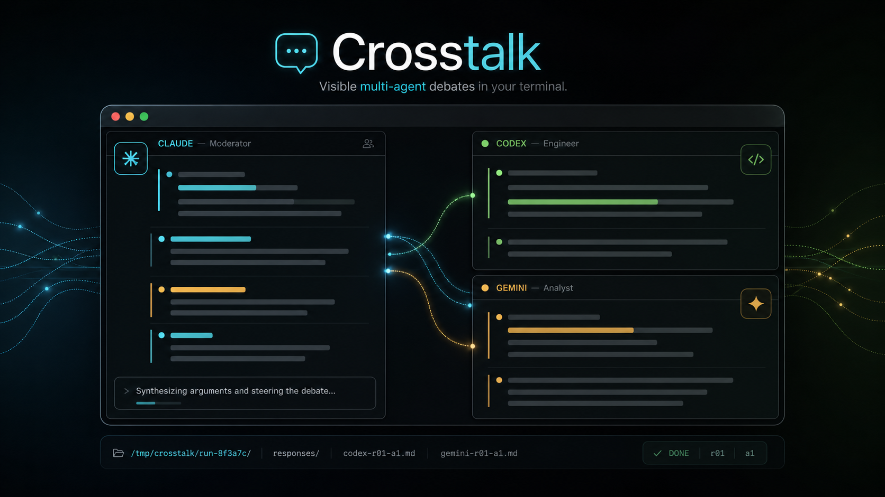

# Crosstalk

[](LICENSE)


Run a visible multi-agent debate between Claude, Codex, and Gemini from one Claude Code slash command.



## Overview

Crosstalk is a Claude Code plugin that coordinates multiple AI CLIs inside [cmux](https://www.cmux.dev/) split panes. Claude acts as the moderator, sends structured debate turns to Codex and Gemini, reads their responses, and produces a final summary.

Unlike headless multi-agent tools, Crosstalk keeps the work visible. You can watch each CLI respond in its own pane while Claude manages the conversation.

## Features

- **Use your existing CLI subscriptions**: no separate API keys or per-token integration required.
- **Visible multi-agent workflow**: Claude, Codex, and Gemini run in neighboring cmux panes.
- **Claude as moderator**: the calling Claude session asks, challenges, summarizes, and decides when the debate is done.
- **File-based response transport**: responses are written to `/tmp/crosstalk/run-*/responses/*.md`, avoiding terminal scrollback loss for long answers.
- **PR review mode**: ask multiple AI CLIs to review a GitHub PR and discuss merge readiness.
- **Rules and personas**: switch between lightweight brainstorming, stricter debate, or custom role presets.

## Requirements

| Tool | Required | Notes |
| --- | --- | --- |
| macOS 14+ | Yes | cmux is macOS-only |
| Node.js + npm 18+ | Yes | Used to install missing AI CLIs |
| cmux 1.3+ | Yes | `brew install --cask cmux` |
| jq | Yes | Used for rules/persona config |
| GitHub CLI | Optional | Required for PR review mode |

You only need the AI CLIs you plan to use. `/crosstalk:install` can help install missing Codex and Gemini CLI packages through npm.

## Language

Crosstalk supports English and Korean command UI. During `/crosstalk:install`, choose the interface language:

- English
- Korean

The setting is stored in:

```text
~/.claude/crosstalk/config.json
```

```json
{
  "active_rules": "default",
  "active_persona": "default",
  "language": "en"
}
```

Use `"language": "ko"` for Korean. Built-in rules and personas are installed in both languages:

```text
~/.claude/crosstalk/rules/{en,ko}/
~/.claude/crosstalk/personas/{en,ko}/
```

## Installation

In Claude Code:

```text
/plugin marketplace add dongsik93/crosstalk
/plugin install crosstalk@dongsik93/crosstalk
```

Then run the one-time setup:

```text
/crosstalk:install
```

This installs:

- `~/.claude/scripts/crosstalk_bridge.sh`
- `~/.claude/commands/crosstalk.md`
- built-in rules and personas under `~/.claude/crosstalk/`

## Quick Start

Start or attach to a cmux workspace:

```text
/crosstalk:launch
```

Then run a debate from the Claude pane:

```text
/crosstalk Should this Android project use Compose or XML?
```

For PR review:

```text
/crosstalk:review 1440
```

Deep PR review is available but experimental:

```text
/crosstalk:review --deep 1440
```

`--deep` checks out the PR branch in the current working directory and attempts to restore the previous branch afterward. Use the default fast review mode unless you explicitly need repository-wide context.

## Demo


## Commands

### Debate

| Command | Description |
| --- | --- |
| `/crosstalk <topic>` | Shortcut for a standard debate |
| `/crosstalk:debate <topic>` | Standard debate with one or more peer CLIs |
| `/crosstalk:debate --rules <name> <topic>` | Use a rules preset once |
| `/crosstalk:debate --persona <name> <topic>` | Use a persona preset once |
| `/crosstalk:review [PR]` | Fast PR review using `gh pr diff` |
| `/crosstalk:review --deep [PR]` | Experimental deep PR review with checkout/stash/restore |

### Setup and Configuration

| Command | Description |
| --- | --- |
| `/crosstalk:install` | Install Crosstalk components into the user home directory (use `--presets-only [--language en\|ko]` to refresh just the rules/personas) |
| `/crosstalk:launch` | Create cmux splits, start AI CLIs, and label panes |
| `/crosstalk:setup` | Label already-open cmux panes (use `--language en\|ko` to also switch UI language) |
| `/crosstalk:status` | Show active rules, personas, and pane status |
| `/crosstalk:rules` | Switch, create, edit, or delete debate rules |
| `/crosstalk:persona` | Switch, create, edit, or delete personas |
| `/crosstalk:uninstall` | Remove user-level Crosstalk components |

## How It Works

1. Claude scans the current cmux workspace for peer AI CLI panes.
2. Claude sends each peer a safe-mode preamble and a self-contained debate turn.
3. Each peer writes its answer to a designated response file.
4. The peer prints a short `DONE <msg-id>` marker.
5. Claude reads the response files, continues the debate, and produces a final summary.

Example run directory:

```text
/tmp/crosstalk/run-PpP6hTWx/
  manifest.json
  responses/
    codex-r01-a1.md
    gemini-r01-a1.md
```

The screen is still useful for visibility, but the actual answer transport is file-based.

## Rules and Personas

Built-in rule presets:

| Rule | Style |
| --- | --- |
| `default` | natural reasoning flow, balanced, constructive |
| `brainstorm` | short, exploratory, yes-and style |
| `debate` | deeper critique, slower agreement |

Built-in persona presets:

| Persona | Roles |
| --- | --- |
| `default` | no assigned persona |
| `senior-junior` | conservative senior vs progressive junior |
| `critic-builder` | critic vs builder |
| `triple-perspective` | conservative, innovator, pragmatic |

Example:

```text
/crosstalk:debate --rules debate --persona critic-builder Should we merge this PR?
```

Custom presets live here:

```text
~/.claude/crosstalk/rules/
~/.claude/crosstalk/personas/
```

## Limitations

- **macOS only**: Crosstalk currently depends on cmux.
- **CLI UI detection can change**: launch readiness and auto-detection use CLI footer patterns. If detection fails, run `/crosstalk:setup` and label panes manually.
- **No hard sandbox**: Crosstalk instructs peer CLIs to write only their response file, but it cannot fully sandbox another CLI process.
- **AI may ignore transport instructions**: this is handled as a protocol error with retry/skip/stop choices.
- **Deep PR review is experimental**: it touches the current git worktree through checkout/stash/restore.
- **Claude-only moderation**: Codex/Gemini moderator mode is not supported in v0.1.

## Roadmap

- Codex and Gemini moderator modes
- Additional CLI adapters
- tmux and zellij support
- Better troubleshooting docs
- More robust launch detection
- Public examples of real PR review sessions

## Contributing

Issues and pull requests are welcome. Good first contributions include:

- updating CLI footer detection patterns
- adding rules or persona presets
- improving install and troubleshooting docs
- testing against different Codex/Gemini/Claude CLI versions
- exploring tmux or zellij adapters

## License

Crosstalk is released under the [MIT License](LICENSE).
